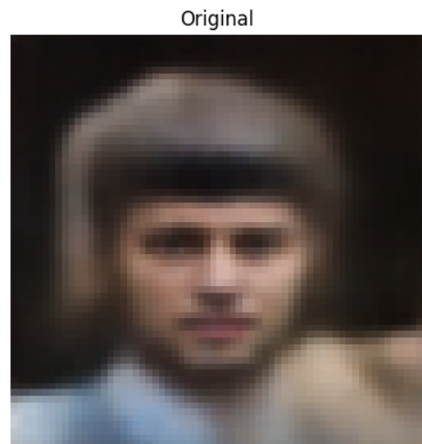
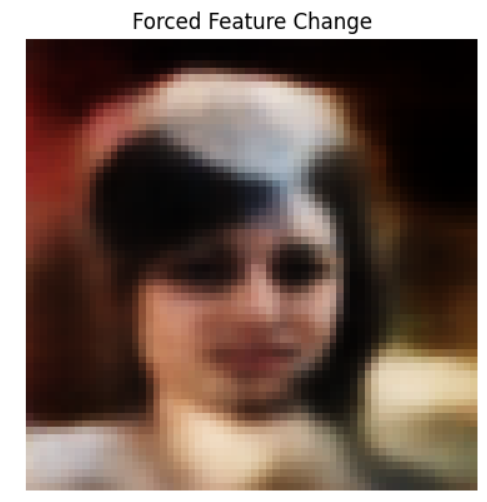

# Celebrity-Face-Generation-VAE
A Variational Autoencoder (VAE) trained from scratch in PyTorch on the CelebA dataset, featuring latent space exploration and facial attribute manipulation.
# CelebA Face Generation & Latent Space Manipulation using VAE

An end-to-end implementation of a **Variational Autoencoder (VAE)** built completely from scratch using **PyTorch**. The model is trained on the **CelebA dataset** (containing over 200,000 celebrity faces) to generate brand new human faces and perform latent vector manipulation.

## 🚀 Features
- **Custom VAE Architecture:** Structured Encoder-Decoder networks with convolutional layers (`Conv2d` and `ConvTranspose2d`) implemented in PyTorch.
- **Latent Space Exploration:** Implemented vector arithmetic in the 128-dimensional latent space to stimulate explicit facial features.
- **Forced Attribute Modification:** Demonstrates latent entanglement concepts by inducing structural edits (like forcing shadows, shades, and style variations).

## 📊 Visual Results

### Latent Space Manipulation
Below is the result of applying a heavy vector offset to the initial latent dimensions, showcasing a direct transition from the original base face to a forced visual feature modification:

| Original Reconstruction | Forced Feature Change |
| :---: | :---: |
|  |  |

*(Note: Due to standard VAE characteristics, the outputs capture dense structural variations such as regional shadows/shades alongside minor latent entanglement side-effects like gender or hair distribution shifts).*

## 🛠️ Tech Stack & Concepts Used
- **Language:** Python
- **Framework:** PyTorch
- **Libraries:** NumPy, Matplotlib, Torchvision
- **Key Algorithms:** Stochastic Gradient Descent, Reparameterization Trick, KL-Divergence Loss, Structural Convolutions.

## 🏃 How to Run the Project
1. Clone this repository:
   ```bash
   git clone [https://github.com/YOUR_USERNAME/REPOSITORY_NAME.git](https://github.com/gladiator456/Celebrity-Face-Generation-VAE.git)
